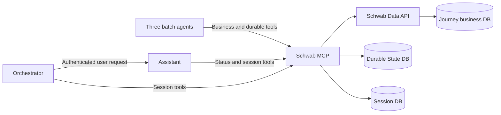

# Durable Journey execution through Schwab MCP

All five agents use Schwab MCP for database access. Their service accounts have
no direct permissions on Journey business, durable, or session databases.
The [Schwab implementation reference](references/schwab-mcp/README.md) contains
server-side handlers, tool schemas, SQL references, and transaction requirements.
The [tool request](SCHWAB_MCP_TOOL_REQUEST.md) is the handoff for Schwab engineering.

## Responsibilities

| Component | Responsibility |
| --- | --- |
| APM Validation | Run and recover validation using MCP business and durable tools. |
| AD Provisioning | Submit once, retain the MyAccess ID, and poll that request later. |
| App Factory | Validate readiness/schema after AD business success; stop at readiness. |
| Assistant | Explain authorized Journey status and persist its conversation through MCP. |
| Orchestrator | Route to Assistant and persist its own conversation through MCP. |
| Schwab MCP | Authenticate workloads/users, authorize scope, and transact durable/session persistence. |
| Schwab business services / Data API | Own business rules, transitions, results, dependencies, and provider reconciliation. |
| External coordinator | Sequence jobs and schedule polling while approval is pending. |

Shared Python code is copied into each agent image; it is not a network intermediary.
Agent workflows remain in `app/job.py`, durability bindings in `app/durability.py`,
and entry points in `app/server.py`. The shared durability package does not depend
on `batch.py` or `batch_server.py`, preserving portability into the main repository.

## Three separate stores

| Store | Records | Meaning |
| --- | --- | --- |
| `cloud-journey-db` | Journeys, ownership, business audit, operation results, external dependencies | Authoritative business outcome and user-visible progress. |
| `durable-state-db` | Executions, checkpoints, checkpoint events, mutation receipts | Recoverable progress, lease/version ownership, and replay receipts. |
| `session-db` | ADK v1 sessions/events/app/user state and MCP protocol sidecars | Conversation continuity, atomic event/state writes, revisions, and deletion protection. |

Journey IDs correlate business and durable records logically; they are not
cross-database foreign keys. Session scope is application/user/session ID.
Schema and table definitions are in [migrations/](migrations/README.md).
Schwab owns migrations and DB permissions. No transaction spans these stores.

## Checkpoint stages and statuses

| Stage | Agent | Persisted reference |
| --- | --- | --- |
| `APM_VALIDATION` | APM Validation | Business validation result |
| `AD_SUBMISSION` | AD Provisioning | Submission outcome and provider request when established |
| `AD_POLLING` | AD Provisioning | Same provider request ID and latest recorded observation |
| `APP_FACTORY_VALIDATION` | App Factory | Readiness/validation result |

The five statuses are `PENDING` (initial), `RUNNING` (step started), `WAITING`
(recorded AD pending outcome), `COMPLETED` (business outcome recorded), and `FAILED`
(attempt failed). A completed negative business result reports `successful=false`,
stopping orchestration. WAITING releases the lease and requires a later invocation;
it does not hold a database lock through approval.

An operation checkpoint is unique by Journey/operation, with a current execution
ID, version, lease expiry, stage, status, business result reference, and optional
provider reference. Each invocation creates a new execution; checkpoint audit
events retain the execution that made each saved change.

## Invocation and recovery

1. The agent calls `claim_durable_operation`. Schwab authorizes its workload and
   Journey, creates or claims the operation, and returns the current snapshot.
2. The runtime calls `get_journey_operation` before repeating business work.
3. It saves RUNNING through `save_durable_checkpoint`, then invokes the business
   tool using a stable logical idempotency key.
4. Schwab's business service commits its result and permitted transitions. The
   agent saves the corresponding stage/status/references through MCP.
5. `finish_durable_operation` records the execution outcome and releases its lease.

All durable mutations carry a mutation ID. Schwab commits the response receipt,
state change, and audit rows in one transaction. Lost-response retries replay the
original acknowledgment. Save/finish require matching execution, version, and
active lease; stale workers cannot write after another invocation takes over.
Lease time comes from the database clock after lock acquisition.

If a business result commits before its checkpoint save, a later invocation reads
that result and repairs progress without repeating the external action. If a
checkpoint acknowledgment is uncertain, the invocation stops; it must not overwrite
potentially newer progress with FAILED from an old snapshot. MyAccess submission
still needs provider reconciliation: a DB transaction alone cannot prevent a
duplicate external action after an ambiguous provider response.

## Session persistence

Both chat runtimes use five MCP session tools: create, get, list, append event,
and delete. Calls carry verified delegated user identity separately from arguments
and are never exposed to the model. Event append atomically commits the full ADK
event, state delta, version, and receipt. `temp:` state and tokens are not persisted.
Cross-user/app access and stale versions fail closed. Conversation writes grant
no permission to change Journey business state or durable checkpoints.

## Integration and validation

Use [MCP_CONTRACT.md](MCP_CONTRACT.md) for the overall interface,
[the Schwab reference](references/schwab-mcp/README.md) for tool-building details,
[migrations](migrations/README.md) for schema deployment, and
[GCP_DEPLOYMENT.md](GCP_DEPLOYMENT.md) for agent deployment without DB privileges.
Local contract tests do not establish Schwab's actual authentication, PostgreSQL
locking across replicas, IAM/network configuration, or provider idempotency;
validate those in Schwab's integration environment before production deployment.
