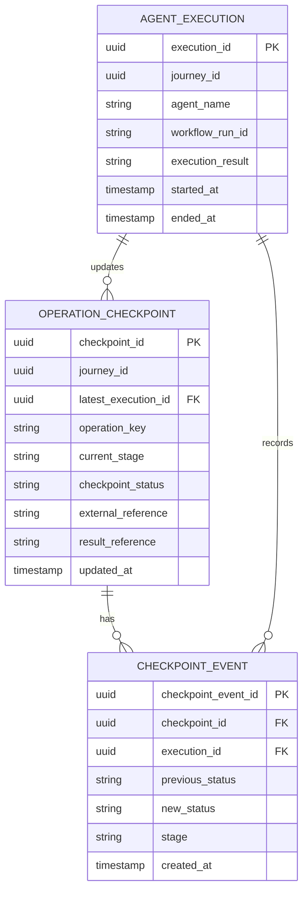

# Durable State for Non-Interactive Agents

**Design status:** Proposed  
**Updated:** 23 September 2026

## Purpose

Durable state preserves an agent's execution progress beyond a single job invocation. A later invocation loads the saved checkpoint, checks the current Journey outcome, and continues unfinished work using the saved stage and references.

Only three non-interactive agents manage durable execution: **APM Validation**, **AD Provisioning**, and **App Factory Helper**. They create, update, and resume execution checkpoints. The **Chat Assistant provides read-only visibility into persisted Journey progress** through private MCP and the Data API. The orchestrator and Chat Assistant have no direct access to the durable checkpoint store.

## Components and responsibilities

| Component | Responsibility |
| --- | --- |
| APM Validation Agent | Saves the APM validation stage and validation result reference. |
| AD Provisioning Agent | Saves the submission or polling stage, MyAccess request ID, and latest result. The same agent handles submission and subsequent polling. |
| App Factory Helper Agent | Saves request validation progress and the ready or validation-error result. |
| Chat Assistant | Reads authorized Journey status and explains progress to the user. It does not create, update, or resume execution checkpoints. |
| Workflows | Starts the declared agent jobs in order and waits for each execution. The sequence is APM validation, AD submission, AD polling, and App Factory validation. |
| Job runtime persistence | Code inside each agent job that loads checkpoints and saves execution progress and history. |
| Durable State DB | Stores agent execution records, operation checkpoints, and checkpoint history. |
| Session DB | Stores conversation sessions, history, and context through the session persistence layer used by the orchestrator and Chat Assistant runtimes. |
| Private MCP server | Provides business operations for the batch agents and authorized Journey status reads for the Chat Assistant. |
| Data API | Reads and updates the Journey business records used by those operations. |
| Journey DB | Holds the current business stage and recorded outcome for each Journey. |

Workflows controls job order. Each agent uses its own saved progress to determine where its operation can resume. The jobs do not call one another.

## Business state, durable state, and session state

| State type | What it records | Example |
| --- | --- | --- |
| Business state in Journey DB | The Journey's business stage and outcome | `APM_VALIDATED` or `READY_TO_PROVISION` |
| Execution state in Durable State DB | The agent operation's saved stage, checkpoint status, and references | AD polling is `WAITING`, with a saved MyAccess request ID |
| Conversation state in Session DB | Conversation history and interaction context | Context used by the orchestrator and Chat Assistant |

The broader Journey lifecycle and business events belong to business tracking. The durable checkpoint model records execution progress for the three batch agents. Conversation history is not required to resume a batch operation.

## Chat Assistant status checks

The read path is **Chat Assistant → private MCP → Data API → Journey DB**.

The Chat Assistant uses the user's authorized access to explain the current Journey stage, whether MyAccess is pending, the validation outcome, and whether a request is ready to provision. These answers come from persisted business progress in Journey DB.

A status query does not start or resume a batch job and does not change a checkpoint. Managing durable execution remains the responsibility of the three non-interactive agents.

## Five statuses, multiple checkpoint stages

This design uses **five checkpoint statuses**. They describe the condition of an operation, not its position in the business lifecycle.

| Checkpoint status | Meaning |
| --- | --- |
| `PENDING` | The operation has been identified but has not started. |
| `RUNNING` | An agent invocation is processing the operation at its current stage. |
| `WAITING` | The operation is awaiting an external result. Its stage and external reference are saved for a later invocation. |
| `COMPLETED` | The operation's outcome has been recorded and its final checkpoint saved. |
| `FAILED` | The attempt stopped with an error. The last checkpoint and error information are retained for recovery. |

A checkpoint combines three pieces of information:

- **Stage:** which part of the operation has been reached, such as APM validation or AD polling.
- **Status:** the condition of that operation, selected from the five values above.
- **Saved context:** the references needed to continue, such as a MyAccess request ID or validation result reference.

For example, `WAITING` alone cannot identify what to resume. A checkpoint stating **AD polling / WAITING / MyAccess request MA-8472** identifies both the unfinished work and the request to check.

`COMPLETED` applies to an individual agent operation. It does not mean that the entire Journey or downstream provisioning has completed. Similarly, a job invocation can finish while an operation remains `WAITING`.

## Data model

The proposed model uses three databases on one Cloud SQL instance: **`cloud-journey-db`** for business records, **`durable-state-db`** for batch execution checkpoints, and **`session-db`** for conversation state.

Journey business records and durable execution records are correlated by `journey_id`. Conversation sessions are identified by their application, user, and session identifiers; they do not require a checkpoint relationship.

The checkpoint table is still needed even though only five checkpoint statuses are used. A status is one field within the saved execution context; it does not identify the agent, Journey, operation stage, or external request to resume.

### Database responsibilities

| Database | Records | Purpose |
| --- | --- | --- |
| `cloud-journey-db` | `JOURNEYS`, `JOURNEY_OPERATION_STATUS`, `JOURNEY_EXTERNAL_DEPENDENCY`, and optional `JOURNEY_OPERATION_ATTEMPT` | Business state and business-facing progress for the application, Chat Assistant, and operational views. |
| `durable-state-db` | `AGENT_EXECUTION`, `OPERATION_CHECKPOINT`, and `CHECKPOINT_EVENT` | Agent execution context, resumable checkpoints, and checkpoint history, managed by the three batch agents. |
| `session-db` | Session metadata, conversation messages/events, and session context; physical tables are managed by the selected session persistence implementation | Conversation continuity for the orchestrator and Chat Assistant runtimes. |

The Chat Assistant continues to read authorized business progress through **private MCP → Data API → Journey DB**. It does not query the durable tables directly.

The [three-database boundary diagram](mermaid/database_boundaries.mermaid) shows the stores and their persistence paths. Session DB is separate from both Journey business records and the three durable checkpoint tables.

### Session DB

Session DB persists the conversation context used by the orchestrator and Chat Assistant. Their session persistence layer loads and saves this information so a later turn or restarted service can continue the same stored session.

| Logical content | Purpose |
| --- | --- |
| Session metadata | Identifies the session and its application and user scope. |
| Conversation history | Retains messages and interaction events for the session. |
| Session context | Retains the conversation state needed for subsequent turns. |
| Timestamps | Records when the session was created or updated. |

These describe the required session data, not a custom SQL schema. The physical session tables and columns depend on the selected session persistence implementation. They are not `AGENT_EXECUTION`, `OPERATION_CHECKPOINT`, or `CHECKPOINT_EVENT`.

The session persistence layer manages conversation writes. The Chat Assistant remains read-only for Journey business operations and does not manage batch checkpoints. Persisting chat context therefore does not make it a durable workflow owner.

A session may contain a Journey reference as conversation context, but the current business status is still read from Journey DB through private MCP and the Data API. Batch agents resume using Durable State DB, independently of the conversation session.

### Durable entity relationships

Source: [durable data model](mermaid/db_model.mermaid). The field types below are logical types from that model.

### AGENT_EXECUTION

An execution record identifies an agent's work for one Journey within a Workflows run. Multiple execution records can share the same `workflow_run_id`.

| Field | Logical type | Key or reference | Purpose |
| --- | --- | --- | --- |
| `execution_id` | UUID | Primary key | Identifies the execution record. |
| `journey_id` | UUID | Logical reference to `JOURNEYS` | Identifies the Journey being processed. |
| `agent_name` | String | — | Identifies APM Validation, AD Provisioning, or App Factory Helper. |
| `workflow_run_id` | String | Workflow correlation | Associates the execution with its Workflows run. |
| `execution_result` | String | — | Records the execution outcome, separately from the operation's checkpoint status. |
| `started_at` | Timestamp | — | Records when this execution started. |
| `ended_at` | Timestamp | — | Records when this execution ended. |

### OPERATION_CHECKPOINT

A checkpoint holds the latest saved progress for a logical agent operation. The record is updated as the operation progresses or resumes in a later invocation.

| Field | Logical type | Key or reference | Purpose |
| --- | --- | --- | --- |
| `checkpoint_id` | UUID | Primary key | Identifies the checkpoint record. |
| `journey_id` | UUID | Logical reference to `JOURNEYS` | Links the operation to its Journey business record. |
| `latest_execution_id` | UUID | Foreign key to `AGENT_EXECUTION.execution_id` | Identifies the execution that most recently updated the checkpoint. |
| `operation_key` | String | Logical operation identifier | Identifies the same operation across invocations. |
| `current_stage` | String | — | Identifies the saved stage, such as APM validation, AD submission, or AD polling. |
| `checkpoint_status` | String | Five-value checkpoint status | Holds `PENDING`, `RUNNING`, `WAITING`, `COMPLETED`, or `FAILED`. |
| `external_reference` | String | External operation reference | Retains an external request ID, such as the MyAccess request ID. |
| `result_reference` | String | Saved result reference | Identifies the recorded validation or processing result. |
| `updated_at` | Timestamp | — | Records when the checkpoint was last saved. |

### CHECKPOINT_EVENT

Checkpoint events preserve the history of saved changes. Each event identifies both the checkpoint and the execution that made the change.

| Field | Logical type | Key or reference | Purpose |
| --- | --- | --- | --- |
| `checkpoint_event_id` | UUID | Primary key | Identifies the checkpoint event. |
| `checkpoint_id` | UUID | Foreign key to `OPERATION_CHECKPOINT.checkpoint_id` | Identifies the checkpoint that changed. |
| `execution_id` | UUID | Foreign key to `AGENT_EXECUTION.execution_id` | Identifies the execution responsible for the change. |
| `previous_status` | String | — | Records the checkpoint status before the change. |
| `new_status` | String | — | Records the checkpoint status after the change. |
| `stage` | String | — | Records the operation stage at the time of the event. |
| `created_at` | Timestamp | — | Records when the event was created. |

An event can retain the same status while recording a new observation. For example, another pending MyAccess poll can produce a `WAITING` → `WAITING` event at the AD polling stage.

### Relationship meanings

| Relationship | Cardinality | Meaning |
| --- | --- | --- |
| `AGENT_EXECUTION` → `OPERATION_CHECKPOINT` | One to zero or many | An execution can be the latest updater of multiple checkpoints. Each checkpoint's `latest_execution_id` identifies its current updater. |
| `OPERATION_CHECKPOINT` → `CHECKPOINT_EVENT` | One to zero or many | One checkpoint accumulates a history of saved changes. |
| `AGENT_EXECUTION` → `CHECKPOINT_EVENT` | One to zero or many | An execution can record multiple checkpoint events. |
| `AGENT_EXECUTION.journey_id` → `JOURNEYS` | Logical correlation across databases | Associates execution records with the business Journey. |
| `OPERATION_CHECKPOINT.journey_id` → `JOURNEYS` | Logical correlation across databases | Associates resumable operation state with the same business Journey. |

When another execution resumes an operation, the checkpoint's `latest_execution_id` is updated. Earlier events retain their original `execution_id`, preserving the history across invocations. The `journey_id` links shown across the databases are logical references, not cross-database foreign keys.

### Business-facing status records

The database boundary diagram identifies the following business records. Their purpose is to expose Journey progress without exposing the internal checkpoint tables.

| Record in `cloud-journey-db` | Purpose |
| --- | --- |
| `JOURNEYS` | Existing Journey business records, including the current business stage and outcome. |
| `JOURNEY_OPERATION_STATUS` | Business-facing visibility into operation progress. |
| `JOURNEY_EXTERNAL_DEPENDENCY` | Business-facing information about an external dependency or wait, such as a pending MyAccess request. |
| `JOURNEY_OPERATION_ATTEMPT` | Optional operation-attempt detail for administrative drill-down. |

The Data API provides access to these business records. They support status reporting; execution checkpoints remain owned by the three batch agents. The relationship model defines the business table names and responsibilities, while the detailed field definitions above cover the three durable tables.

Source: [Cloud SQL database boundaries](mermaid/database_boundaries.mermaid).

## Save and resume flow

1. Workflows starts an agent job.
2. The agent loads its operation checkpoint. If this is new work, it establishes the initial execution context.
3. The agent reads the latest Journey outcome through private MCP and the Data API.
4. It uses the business outcome and saved checkpoint to identify unfinished work.
5. It performs the next operation and records the business outcome through private MCP and the Data API.
6. Once that outcome is confirmed, the agent saves the corresponding stage, status, and references in Durable State DB.
7. The job invocation finishes. A later invocation loads the saved context when more work remains.

When AD processing is waiting, the checkpoint retains the existing MyAccess request ID. Later invocations poll that same request and update the saved progress.

## First checkpoint to last checkpoint

The following example follows one Journey through the three agents to `READY_TO_PROVISION`.

| Checkpoint | Agent | Saved milestone | Checkpoint status | Saved context |
| --- | --- | --- | --- | --- |
| CP01 — first | APM Validation | APM validation started | `RUNNING` | Journey ID, operation key, and validation stage |
| CP02 | APM Validation | APM validation completed | `COMPLETED` | Validation result reference; Journey outcome is `APM_VALIDATED` |
| CP03 | AD Provisioning | AD submission started | `RUNNING` | AD operation key and submission stage |
| CP04 | AD Provisioning | Initial submission accepted; MyAccess request ID received | `WAITING` | Save the returned MyAccess request ID and set the next stage to polling. Later invocations use this ID to check the existing request rather than submit it again. |
| CP05 | AD Provisioning | Later poll of the existing MyAccess request returns pending | `WAITING` | Retain the same request ID; save the latest pending result reference and update time. The next stage remains polling; no new request is submitted. |
| CP06 | AD Provisioning | AD groups confirmed | `COMPLETED` | Request ID and completed group-provisioning result |
| CP07 | App Factory Helper | App Factory validation started | `RUNNING` | Request reference and validation stage |
| CP08 — last | App Factory Helper | Request is ready to provision | `COMPLETED` | Validation result reference; Journey outcome is `READY_TO_PROVISION` |

**CP01–CP08 are illustrative saved snapshots, not eight different statuses or eight workflow steps.** Multiple snapshots can belong to the same agent operation and use the same status.

**CP04 saves the submission result; CP05 saves a later polling observation.** CP04 preserves the request ID needed to resume polling. CP05 shows that the existing request was checked again and was still pending at that time. Both are successive updates to the same logical AD operation checkpoint, with saved changes recorded in `CHECKPOINT_EVENT`; they do not require separate checkpoint records or different status values.

CP05 repeats on later polls while MyAccess remains pending. If the first poll confirms completion, processing proceeds directly from CP04 to CP06. This successful-path example does not pass through every possible checkpoint status.

CP08 is the final checkpoint for the three-agent flow. The App Factory Helper has recorded readiness, and subsequent provisioning is outside this durable agent execution scope.

## Supporting diagrams

- [Components and ownership](previews/01.svg)
- [State storage responsibilities](previews/02.svg)
- [Checkpoint lifecycle](previews/03.svg)
- [Save and resume sequence](previews/04.svg)
- [Durable data model](mermaid/db_model.mermaid)
- [Cloud SQL database boundaries, including Session DB](mermaid/database_boundaries.mermaid)
- [First to last checkpoint](previews/06.svg)

Checkpoint statuses, stage names, and data fields describe the proposed design. Diagram references point to the accompanying SVG previews and Mermaid source files.
