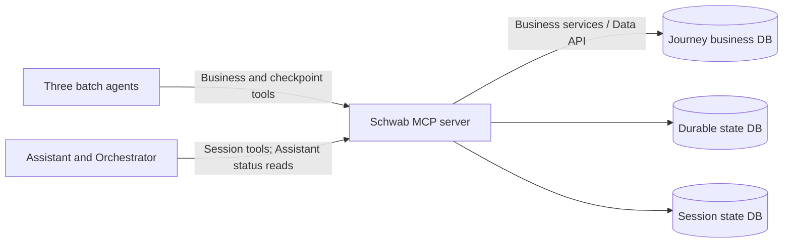

# Schwab MCP persistence implementation reference

All deployed agents access business, durable, and session state through Schwab's
authenticated MCP server. Agent service accounts have no database access. This
directory supplies executable **server-side handlers**, input schemas, and SQL
references for Schwab to integrate into its existing MCP host. It is excluded
from every agent image; it is not a deployed or authenticated MCP server by itself.



The existing business capabilities and status reads are specified in
[SCHWAB_MCP_TOOL_REQUEST.md](../../SCHWAB_MCP_TOOL_REQUEST.md). The eight persistence
tools below are additional runtime capabilities. They are never exposed to the
chat model as callable tools. Tool names below are the exact names the current
client calls; register aliases or agree a central mapping if Schwab uses PascalCase.

## Schema and deployment ownership

Run the [migration entry points](../../migrations/README.md) using a Schwab migration
identity. Only the MCP persistence service and approved business services receive
database credentials and data privileges. Agents receive MCP invocation permission.

| Store | SQL files | Tables and purpose |
| --- | --- | --- |
| Journey business DB | [business-state/apply.sql](../../migrations/business-state/apply.sql) | Journeys, authorization, business audit, operation results, and external dependency references. Adapt this reference to Schwab's existing business schema/Data API. |
| Durable state DB | [000_execution_checkpoints.sql](../../migrations/durable-state/000_execution_checkpoints.sql), [001_mcp_mutation_receipts.sql](../../migrations/durable-state/001_mcp_mutation_receipts.sql) | `agent_execution`: attempt ownership and outcome; `operation_checkpoint`: one row per Journey/operation, version, lease, progress; `checkpoint_event`: audit; `mcp_mutation_receipt`: atomic retry response. |
| Session state DB | [000_adk_sessions.sql](../../migrations/session-state/000_adk_sessions.sql), [001_mcp_session_protocol.sql](../../migrations/session-state/001_mcp_session_protocol.sql) | ADK v1 session/event/app/user state and metadata; `mcp_session_revision`: concurrency version; `mcp_session_event`: event order and hash; `mcp_session_tombstone`: deleted identity protection; `mcp_mutation_receipt`: atomic retry response. |

Journey IDs are logical references across databases. No transaction spans the
three databases. Business tools commit their own results; after interruption,
`get_journey_operation` reconciles a business commit that preceded a checkpoint
save. Checkpoint tools never update Journey business status.

Session tables match `google-adk==2.9.2`, schema v1. For an existing ADK database,
pause writers and review a backfill of `mcp_session_revision` and
`mcp_session_event` before enabling these handlers. Establish a deterministic event
order, set event sequences and a session version above the imported sequence,
and calculate canonical event hashes using `service.digest`. Validate all existing
events have sequence rows. The baseline intentionally does not guess legacy event
ordering or identity mappings. Existing sessions without a revision return
`MIGRATION_REQUIRED`; v0/Pickle data needs a separate ADK migration first.
After cutover, all session writers must use these handlers so revisions and
receipts remain authoritative.

## Host integration

Install on the server side, using Python 3.11+:

```powershell
python -m pip install ./references/schwab-mcp
```

The standalone package needs no deployed agent package. The main entry points are:

```python
from sqlalchemy import create_engine
from schwab_mcp_persistence.service import PersistenceService, Principal, ToolError
from schwab_mcp_persistence.requests import tool_catalog

service = PersistenceService(
    durable_engine=create_engine(schwab_durable_db_url),
    session_engine=create_engine(schwab_session_db_url),
    batch_workloads={
        apm_service_identity: "apm-validation-agent",
        ad_service_identity: "ad-provisioning-agent",
        factory_service_identity: "app-factory-helper-agent",
    },
    chat_workloads={
        assistant_service_identity: "journey_assistant",
        orchestrator_service_identity: "journey_orchestrator",
    },
    authorize_journey=schwab_authorization_check,
    lease_seconds=300,
)
```

Names in this example are host-supplied configuration/functions, not secrets to
place in source. `schwab_authorization_check(principal, journey_id)` must check
Journey existence, workload scope, and applicable business authorization and
return a boolean. Do not replace it with an unconditional allow in production.

Register `tool_catalog()` with the MCP host. For every invocation, middleware
must verify the workload credential and, for sessions, the delegated user token,
including its approved issuer and audience. Construct `Principal(workload,
user_id, email, display_name)` **from those verified claims**, never tool arguments
or unverified headers. These Python handlers assume that authentication has
already occurred. They then enforce workload/agent or workload/app/user binding
and Journey authorization themselves, including on receipt replay.

Invoke `service.execute(tool_name, arguments, principal)` in the host's synchronous
worker pool. Return its dictionary in MCP `structuredContent`; represent a null
read using a single text content block containing `null`. Convert `ToolError`
using `exc.mcp_result()`. The host must convert unexpected database exceptions to
sanitized server errors, without returning connection strings or SQL parameters.
The reference has no network listener, token verifier, or deployment/IAM setup.

Machine-readable input schemas are generated by the same models that validate
requests. This command exports all eight, including the pinned ADK event schema:

```powershell
python -c "import json; from schwab_mcp_persistence.requests import tool_catalog; print(json.dumps(tool_catalog(), indent=2))" > persistence-tool-catalog.json
```

Input models reject unknown top-level properties. Limits: Journey ID 32 characters;
workflow ID and result/external references 256; checkpoint/execution IDs 36;
application/user/session IDs 128; mutation ID 64. Confirm these limits against
Schwab identifiers before integration; change schemas and clients together.

## Common mutation and concurrency contract

Every mutation includes a nonempty `mutation_id` unique to that exact request.
The agent creates it before sending and retries a recognized transport failure
once with the **same ID and payload**. The server writes state changes, audit or
event rows, and a response receipt in one transaction. Identical replay returns
the original response without another mutation. Reusing an ID with different
input returns `IDEMPOTENCY_CONFLICT`. Reads have no mutation ID.

Receipts are keyed by verified principal, tool, and mutation ID. PostgreSQL
transaction advisory locks serialize receipt ownership and resource access, and
checkpoint rows are additionally locked. The database clock, read after acquiring
locks, determines leases. Versions are positive integers; save, finish, and event
append require the exact expected version and return its increment by one.
Receipt replay returns the historical version/lease; it does not reacquire or
extend a lease. A later stale or expired mutation must fail.

Keep durable receipts for at least the supported retry/recovery horizon and agree
a retention policy with Schwab. The reference does not prune them automatically.
Session receipts can contain conversation data and must follow session privacy
and retention controls. Deleting a session removes its old receipts and leaves a
tombstone plus a content-free delete receipt, preventing an old create request
from resurrecting that session ID. App/user shared state has a separate lifecycle.

## Durable tools

Only the three batch service identities may invoke these tools. Agent names map
to operations on the server; an argument does not grant access to another agent.

| Tool | Input | Transaction and response |
| --- | --- | --- |
| `claim_durable_operation` | `journey_id`, `agent_name`, `workflow_run_id`, `mutation_id` | Create or reclaim the Journey/operation checkpoint, create one execution, and acquire a 300-second lease. Reject an active lease with `OPERATION_BUSY`. Return the full checkpoint envelope below. |
| `save_durable_checkpoint` | Claim fields plus `checkpoint_id`, `execution_id`, `expected_version`, `current_stage`, `checkpoint_status`; nullable `external_reference`, `result_reference`, `last_error` | Verify execution, workflow, version, and live lease; atomically save progress and audit. Preserve the lease deadline and return version + 1. |
| `finish_durable_operation` | Claim fields plus `checkpoint_id`, `execution_id`, `expected_version`; nullable `error` | Verify ownership/version/lease, record attempt outcome, clear the lease, and return version + 1. Preserve checkpoint stage/status/references. |

`agent_name` is one of `apm-validation-agent`, `ad-provisioning-agent`, or
`app-factory-helper-agent`. Initial stages are respectively `APM_VALIDATION`,
`AD_SUBMISSION`, and `APP_FACTORY_VALIDATION`. Only AD may advance to `AD_POLLING`
or use `WAITING`; it cannot return from polling to submission or change an
established provider request ID. Status values are `PENDING`, `RUNNING`, `WAITING`,
`COMPLETED`, and `FAILED`. WAITING/COMPLETED need a persisted business result
reference; AD_POLLING also needs the provider request reference.

Example claim:

```json
{"journey_id":"J-123","agent_name":"ad-provisioning-agent","workflow_run_id":"RUN-123","mutation_id":"b7d4fe76-e0e6-4f81-953b-c080206448b5"}
```

All three tools return the same shape (finish sets `lease_expires_at` to null):

```json
{
  "checkpoint": {
    "checkpoint_id":"61e67779-cab0-48f6-b778-25305e3c572e",
    "journey_id":"J-123",
    "agent_name":"ad-provisioning-agent",
    "workflow_run_id":"RUN-123",
    "latest_execution_id":"907b3f84-25d3-4621-a9a0-868b275e519a",
    "operation_key":"ad-provisioning",
    "current_stage":"AD_SUBMISSION",
    "checkpoint_status":"PENDING",
    "external_reference":null,
    "result_reference":null,
    "last_error":null,
    "version":1,
    "lease_expires_at":"2026-09-25T16:05:00+00:00"
  }
}
```

The lease covers one bounded invocation; it is not held during human approval.
Set job/request timeout below the lease (deployment example: 240 seconds).
WAITING is saved and the lease released; orchestration polls in a later invocation.
There is no heartbeat tool in this contract. Longer work requires an explicitly
designed lease-renewal protocol or shorter bounded operations.

## Session tools

Only approved chat workload identities may call these tools, with a verified
delegated user. Each call requires `app_name` and `user_id`; a session-specific
call also requires `session_id`. The server checks both against the authenticated
scope. Chat business tools remain read-only; session writes are runtime operations.

| Tool | Additional input | Response and behavior |
| --- | --- | --- |
| `create_agent_session` | `mutation_id`, optional `state` object | Create the client-selected session ID and revision 1; reject existing or tombstoned IDs. Return a session envelope. |
| `get_agent_session` | Optional `config` with `num_recent_events` and/or `after_timestamp` | Return an envelope or JSON null for an absent session within the authorized scope. Never use null for authorization/read failures. |
| `list_agent_sessions` | No session ID | Return `{"sessions":[<envelope>, ...]}` for this app/user only. Summaries contain empty `state` and `events`. |
| `append_agent_session_event` | `mutation_id`, `expected_version`, complete ADK `event` JSON | Atomically persist the event, session/app/user state delta, event sequence, revision, and receipt. Return full session at version + 1. |
| `delete_agent_session` | `mutation_id` | Delete scoped session, events, revision, and old receipts; retain tombstone. Return `{"app_name":"...","user_id":"...","session_id":"...","deleted":true}`. Missing sessions may also be deleted idempotently. |

Session envelope:

```json
{
  "version":1,
  "session":{
    "app_name":"journey_assistant",
    "user_id":"verified-user-subject",
    "id":"chat-123",
    "state":{"auth:google_sub":"verified-user-subject","auth:email":"user@example.com","auth:display_name":"Example User"},
    "events":[],
    "last_update_time":1790352000.0
  }
}
```

Event JSON uses `google.adk.events.Event.model_dump(mode="json", by_alias=False)`.
The full schema comes from `tool_catalog()`; do not replace the event with only
message text. Event ID, invocation ID, author, timestamp, actions/state delta, and
content must survive reload. Partial events are not persisted. `temp:` state is
request-local and is stripped by the client and rejected by the server. `app:`
and `user:` deltas update their ADK shared-state tables in the same transaction.
`auth:` claims must match verified middleware identity; tokens are never stored.

For an append conflict, reload the session before retrying the turn; do not merge
stale snapshots blindly. Duplicate event IDs with a new mutation ID are rejected.
The reference serializes session calls per application to protect shared app/user
state. It also uses a process lock for its SQLite test implementation; refine
that conservative scheduling for production throughput while preserving shared
state and receipt locking. Lists and full transcripts are currently unpaginated;
agree service limits before large-scale use.

## Error contract and acceptance checks

Return MCP `isError: true` with a structured object of this shape:

```json
{"ok":false,"error":{"code":"STALE_CHECKPOINT","message":"Checkpoint ownership or version changed"}}
```

| Codes | Caller action |
| --- | --- |
| `OPERATION_BUSY`, `STALE_CHECKPOINT`, `LEASE_EXPIRED` | Stop this attempt; a coordinator may schedule recovery after the current lease. |
| `STALE_SESSION`, `EVENT_ALREADY_RECORDED`, `ALREADY_EXISTS` | Reload or choose a new session as appropriate; do not replay a stale conversation turn automatically. |
| `FORBIDDEN`, `UNAUTHENTICATED` | Fail closed and correct verified identity/permissions. |
| `INVALID_ARGUMENT`, `IDEMPOTENCY_CONFLICT` | Correct the caller; do not retry changed input with the same mutation ID. |
| `SESSION_NOT_FOUND`, `MIGRATION_REQUIRED`, `TOOL_UNAVAILABLE`, `UNSUPPORTED_DATABASE` | Resolve session lifecycle, migration, or server configuration. |

Before Schwab deployment, validate against PostgreSQL and the actual authenticated
MCP transport: concurrent claims across replicas; expired-lease recovery; stale
worker rejection; response loss after commit; receipt replay and changed-input
conflict; rollback after a mid-transaction failure; app/user isolation; concurrent
session app/user state updates; duplicate event handling; and deletion/replay.
Also run the business/provider reconciliation acceptance checks in the request.

Repository tests exercise the real handlers through fake MCP clients against
server-owned SQLite databases, plus migration DDL compatibility and agent package
boundaries. They do not establish live PostgreSQL locking, Schwab authentication,
Cloud Run IAM, or MyAccess idempotency. These remain integration acceptance work.
